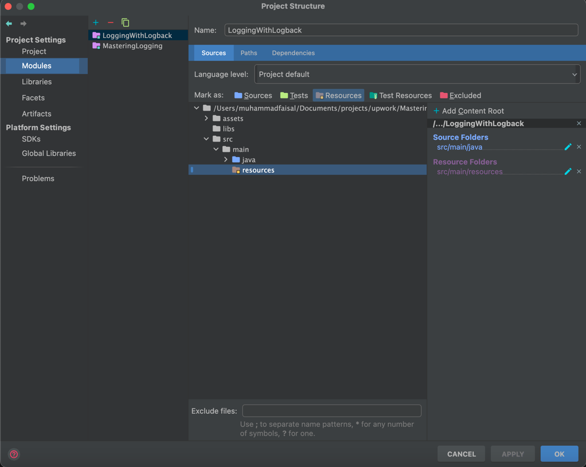

<!-- TOC -->
* [Logging With Slf4j and Slf4j-Simple](#logging-with-slf4j-and-slf4j-simple)
  * [Required dependencies](#required-dependencies)
  * [Code for testing logs](#code-for-testing-logs)
  * [Customised Logging](#customised-logging)
  * [Sample `simplelogger.properties` file](#sample-simpleloggerproperties-file)
  * [Where should the configuration files such as `simplelogger.properties` be located on the classpath?](#where-should-the-configuration-files-such-as-simpleloggerproperties-be-located-on-the-classpath)
  * [Why `simplelogger.properties` or config file ignored or not picked up or doesn't work?](#why-simpleloggerproperties-or-config-file-ignored-or-not-picked-up-or-doesnt-work)
      * [For Maven](#for-maven)
      * [For running the application in the IDE](#for-running-the-application-in-the-ide)
<!-- TOC -->

[Go to main](..)
# Logging With Slf4j and Slf4j-Simple
In this modules we'll configure [Slf4j-Simple][slf4j-simple-url] with [SLF4J][slf4j-url] for logging in a simple Java project.

## Required dependencies
As this is a simple Java project and does not use any build tools like [Maven][maven-url] or [Gradle][gradle-url] etc., 
so we'll have to add the required dependencies explicitly. Following are the dependencies required for logging:
* [slf4j-api-xxx.jar][slf4j-api-jar-url]
* [slf4j-simple-xxx.jar][slf4j-simple-jar-url]

## Code for testing logs
Following is the simple sample code to test different log levels:
```java
package au.com.lucidtech.slf4jsimple;

import org.slf4j.Logger;
import org.slf4j.LoggerFactory;

public class LoggingExample {
    private static final Logger logger = LoggerFactory.getLogger(LoggingExample.class);

    public static void main(String[] args) {
        final String parameter = "logging";
        if (logger.isTraceEnabled()) {
            logger.trace("This is trace " + parameter);
        }
        if (logger.isDebugEnabled()) {
            logger.debug("This is debug " + parameter);
        }

        if (logger.isInfoEnabled()) {
            logger.info("This is info " + parameter);
        }

        logger.warn("This is warn " + parameter);
        logger.error("This is error " + parameter);
    }
}
```
Now, if we run this code, we should be able to see the logs with the default settings/configurations.

## Customised Logging
If we want to customize logging in order to be able to:
* log to console
* log to file
* enable/disable different log levels
* etc.

then we'll need to add the [simplelogger.properties][sample-simplelogger-properties-url] file somewhere on the classpath.

## Sample `simplelogger.properties` file
The following `simplelogger.properties` can be placed in the `src/main/resources` folder:
```properties
org.slf4j.simpleLogger.defaultLogLevel=trace
org.slf4j.simpleLogger.showDateTime=true
org.slf4j.simpleLogger.dateTimeFormat=yyyy-MM-dd 'at' HH:mm:ss.SSS
org.slf4j.simpleLogger.showThreadName=true
org.slf4j.simpleLogger.levelInBrackets=true
```

## Where should the configuration files such as `simplelogger.properties` be located on the classpath?
Configuration files such as `simplelogger.properties` can be located directly under any folder
declared in the class path. For example, if the class path reads `c:/java/jdk15/lib/rt.jar;c:/mylibs/`, then the
`simplelogger.properties` file should be located directly under `c:/mylibs/`, that is as `c:/mylibs/simplelogger.properties`.
Placing it under a sub-folder of `c:/mylibs/`, say, `c:/mylibs/other/`, will not work.

For web-applications, configuration files can be placed directly under `WEB-INF/classes/`.
So you need to put `simplelogger.properties` in the classpath.


## Why `simplelogger.properties` or config file ignored or not picked up or doesn't work?
We need to ensure that the config file is on the class path. We might have created the file in the `src/main/resources`
folder and might assume that, that's it, it should work now. But unfortunately that's not enough as we need to ensure
that it gets copied over to the `target` folder (or wherever you're compiling your project files). 
#### For Maven
So, if we are using some build tool like [Maven][maven-url] then we can use the maven's `resource` plugin to copy them over.
#### For running the application in the IDE
When running the application in IDEs, ensure that the `resources` folder is marked as resources in project setting,
as that'll ensure that the `simplelogger.properties` inside resources folder is copied over to the target folder 
(and that's where the config file will be searched for configuration when the application is started).



[Go to main](..)


<!-- MARKDOWN LINKS & IMAGES -->
<!-- https://www.markdownguide.org/basic-syntax/#reference-style-links -->
[slf4j-url]:https://www.slf4j.org/
[maven-url]:https://maven.apache.org/
[gradle-url]:https://gradle.org/
[slf4j-api-jar-url]:https://mvnrepository.com/artifact/org.slf4j/slf4j-api
[slf4j-simple-jar-url]:https://mvnrepository.com/artifact/org.slf4j/slf4j-simple
[slf4j-simple-url]:https://www.slf4j.org/api/org/slf4j/simple/SimpleLogger.html
[sample-simplelogger-properties-url]:https://github.com/qos-ch/slf4j/blob/master/slf4j-simple/src/test/resources/simplelogger.properties
